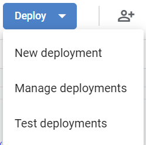
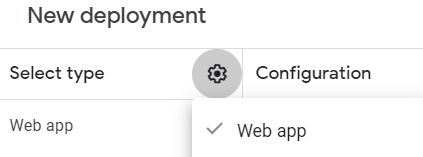
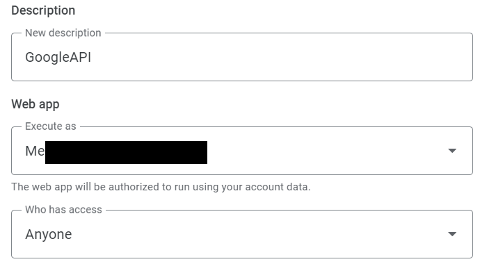
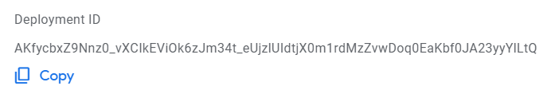
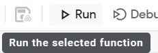

GoogleAPI is a module that allows you to make easy calls to Google APIs.
<br>All methods are <code style="color: red;">read-only</code>.

## Supported services
* [Google Sheets](./Objects/GoogleSheets.md)

## Setup
1. Go to [`Apps Script`](https://script.google.com/home), create a new project and give it a name.
2. Place this [`javascript code`]().
3. Click **Deploy** and **New deployment**.

4. Select **Web app**
 

5. Add a description, run as **Me** and access for **Anyone**


6. Copy the ID and click **Done**.


7. Click **Run** and give it all the permissions it needs.


8. Insert the [module]() into your game and use this code replacing the id
    ```lua
    local GoogleModule = require(game:GetService("ServerStorage").GoogleAPI) -- path to module
    local GoogleAPI = GoogleModule("AKfycbxZ9Nnz0_vXCIkEViOk6zJm34t_eUjzlUIdtjX0m1rdMzZvwDoq0EaKbf0JA23yyYlLtQ")
    ```

9. Check the [documentation](./Objects/GoogleAPI.md).

10. Have fun experimenting :)
